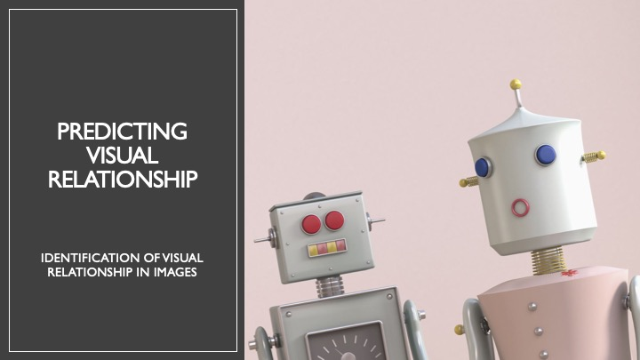
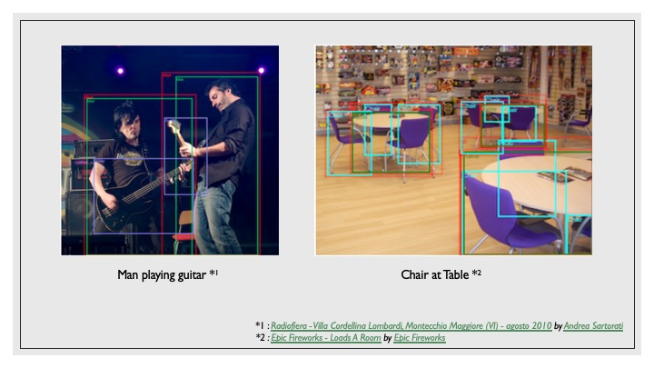
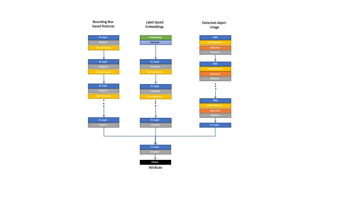
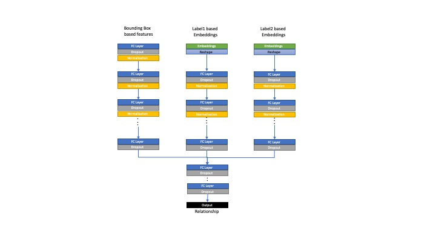

# Relationship Visualization
> Identify a visual relationship in a given image <br />
> This is based on [Kaggle Visual Relationship Track](https://www.kaggle.com/c/open-images-2019-visual-relationship)

## Foreward
This project is addendum to a larger work in liaison with others. However, the published code is entirely mine, and nothing shared in this repository breaches the sanctity of research. Any proposal discussed is also common public domain knowledge, and the actual model implementing it has been withheld.<br /><br />
Further, no model weights have been published so as to ensure no harm comes to this research. <br />

*_Once research completes, with cognizance of the team, will publish the models/ weights as well, because Deep Learning Community growth happens exponentially when there is sharing of published research in public domain._* 
 
## Dataset
The training dataset was derived from [Open Image Dataset v5](https://storage.googleapis.com/openimages/web/index.html) and contains 329 relationship triplets with 375k training samples. These include both human-object relationships (e.g. "woman playing guitar", "man holding microphone"), object-object relationships (e.g. "beer on table", "dog inside car"), and also considers object-attribute relationships (e.g."handbag is made of leather" and "bench is wooden").

The features of this dataset are as follows - 
* ~3.8 lac training images samples
* 57 unique classes (labels)
* 10 relationships (such as 'is', 'on', 'under', 'at', etc.) 
* 5 label attributes (such as 'transparent', 'made of leather', 'made of plastic', 'wooden', etc.)
* 329 valid relationship triplets 

Following types of relationships can be inferred from any image - 


## Approach

Given the nature of training data, each relationship can be decomposed into following types
1. `Subject Label` (L<sub>s</sub>) -> `Relation` (R<sub>o</sub>) -> `Object` (L<sub>o</sub>) : _Bag Pack at Table_
2. `Label` (L<sub>o</sub>) -> `is` -> `Attribute` (A<sub>l</sub>) : _Table is Wooden_

Hence when compounding a description, following structure is achieved <br /><br />
((L<sub>s</sub>) (A<sub>l1</sub>)) -> (R<sub>o</sub>) -> ((L<sub>o</sub>) (A<sub>l2</sub>)) <br />
e.g. Bag Pack made of Fabric at Table which is Transparent <br /><br />
or a simplified version <br /> <br />
((A<sub>l1</sub>) (L<sub>s</sub>)) -> (R<sub>o</sub>) -> ((A<sub>l2</sub>) (L<sub>o</sub>)) <br />
e.g. Transparent Bottle on Wooden Table <br />

## Proposal
Three separate models have been proposed.
1. Input is given to Object Detection Model. Output is a list of Labels, bounding boxes and confidence.
2. This is sent to an Attribute prediction model. Output is list of 'n' attributes for 'n' labels
3. Same input is sent to Relationship Prediction model. Output is list of 'n * (n-1) * 2' relations predicted

### Model 1 : Object Detection
Out of the box object detection model (YOLOv3) is used, which has been retrained using transfer learning for 57 labels.

### Model 2 : Attribute Prediction
Features generated from labels, bounding boxes, Label ROIs are used to predict attribute
   

### Model 3 : Relationship Triplet Prediction
Features generated from 2 labels pair embeddings and bounding boxes are used to predict relation triplets.
   

## Installing / Getting started

This is a python project, and should run fine on version >= 3. 
1. Install python 3.x
2. Create a virtual environment for python

    ```shell
    pip3 install virtualenv
    mkdir ~/.virtualenvs
    
    pip3 install virtualenvwrapper
    export WORKON_HOME=~/Envs
    source /usr/local/bin/virtualenvwrapper.sh
    
    workon
    mkvirtualenv audit_logger
    ```
    This setups up a new virtualenv called audit_logger. <br />

3. Install the required libraries for this project

    ```shell
    pip3 install -r requirements.txt
    ```
4. Install MongoDB and configure it in `conf/config.yaml`

### Initial Configuration

Setup mongoDB correct URL in config.yaml/ or provide environment variables in .env for the url

## Developing

In order to work on this further, use following - 

```shell
git clone git@github.com:usriva2405/visual-relationship-detection-api.git
cd visual-relationship-detection-api/
```

### *Running Code Directly (Non Docker)*

There are 3 ways to run this directly (locally)
1. Use python to run controller directly
    
    ```shell
    python app/controller/flask_controller.py
    curl http://127.0.0.1:5002      # prints Welcome to Audit-Logger
    ```
    
    If the project has been setup, this prints ***Welcome to Audit-Logger*** on console

2. Using WSGI Server for running app (without config)

    You can also use following for running the app : 
    ```shell
    gunicorn -b localhost:5002 -w 1 app.controller.flask_controller:app
    curl http://127.0.0.1:5002      # prints Welcome to Audit-Logger
    ```
    App would be accessible on http://127.0.0.1:8880<br /><br />

3. Using WSGI Server for running app (with config)

    Use following for running the app : 
    ```shell
    gunicorn -c conf/gunicorn.conf.py --log-level=debug app.controller.flask_controller:app
    gunicorn -c conf/heroku-gunicorn.conf.py --log-level=debug app.controller.flask_controller:app
    curl http://127.0.0.1:5002      # prints Welcome to Visual Relationship Prediction!
    ```
    App would be accessible on http://0.0.0.0:5002<br /><br />

## Deploying / Publishing

### Docker
For building the project run
```shell
docker build --no-cache -t visual-relationship:latest .
```

For deploying the project run
```shell
DEV
docker run -d -p 5002:5002 --name visual-relationship -e ENVIRONMENT_VAR=DEV visual-relationship:latest
```

hit localhost:5002 on browser to access the project

## Configuration

Optional : Have mongoDB running and accessible on the URL given in config.yaml

## Sample Request-Response
### Image POST as form-data

We can pass images as form-data (local folder uploads) for verification <br />

URL `localhost:5002/detectobjects` <br />
TYPE `POST (form_data)` <br />
HEADER `Content-Type : multipart/form-data` <br />
SAMPLE request key-value pairs
```
base_image : <<multipart form based image>>
```
<br/>

### Image POST as json

We can also pass images as URLs (s3-bucket URLs) for verification <br />

URL `localhost:5002/detectobjectsjson` <br />
TYPE `POST` <br />
HEADER `Content-Type : "application/json"` <br />
SAMPLE request json
```
{
    base_image : <<image_url>>
}
```

### Heroku deployment

For deploying the project run
```shell
heroku container:login
heroku create visualrelation-api
heroku container:push web --app visualrelation-api
heroku open --app visualrelation-api
```

## Contributing

If you'd like to contribute, please fork the repository and use a feature
branch. Pull requests are warmly welcome.

## Links

- Repository: git@github.com:usriva2405/visual-relationship-detection-api.git
- Issue tracker: Use JIRA
  - In case of sensitive bugs like security vulnerabilities, please contact
    utkarshsrivastava.cse@gmail.com directly instead of using issue tracker.